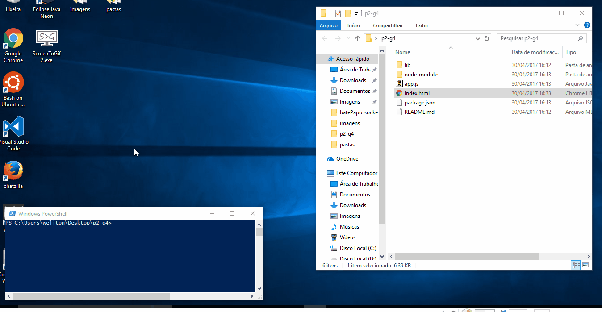

# Projeto 2 - Grupo 4

## Proxy IRC com Web Services e Web Sockets

### Membros:

* **Weliton Marcos** - Líder/Desenvolvedor :crown: :computer:

* **Gilmar Bernades** - Desenvolvedor :computer:
* **João Victor Guimarães** - Desenvolvedor :computer:

* **Gerson Rosolim** - Documentador :writing_hand:
* **Yan Rocha** - Documentador :writing_hand:

## Especificação

### Objetivos
-----------------------

Este projeto 2 tem o objetivo de desenvolver uma interface WEB utilizando WebSocket (Socket.io) para o protocolo IRC.

### Aspectos teóricos
-----------------------

Para o desenvolvimento do projeto foram envolvidas os seguintes aspectos teóricos:

* Web Services: SOA, REST, JSON;
* Comunicação assíncrona: eventos, notificações, funções de callback;
* Comunicação solicitação/resposta: pooling, cookies;
* Programação web: roteamento, métodos GET/POST;
* Arquitetura proxy;
* Comunicação socket: protocolo IRC;
* Arquitetura publish/subscribe

### Aspectos técnicos
-------------------------

Para o desenvolvimento do projeto foram envolvidas os seguintes aspectos técnicos:

- **Front-end:** [JQuery](https://www.w3schools.com/jquery/default.asp), [Cookies] (https://pt.wikipedia.org/wiki/Cookie_HTTP), [HTML/Forms] (https://www.w3schools.com/html/html_forms.asp);
- **Back-end:** [Nodejs](http://nodebr.com/o-que-e-node-js/), [JavaScript](https://www.w3schools.com/js/), [IRC](https://tools.ietf.org/html/rfc2812)
- **WebSockets:** [Socket.io](https://imasters.com.br/tecnologia/redes-e-servidores/conectando-no-socket-io-o-basico/?trace=1519021197&source=single)

## Documentação na Wiki (Em Construção) :construction_worker:
Consulte nossa Documentação na [Wiki](https://gitlab.com/ad-si-2017-1/p2-g4/wikis/home) 

### Changelog

A nomenclatura das Changelogs ficaram definidas como *número.release.build*.

***Version 1.0.0*** [https://gitlab.com/ad-si-2017-1/p2-g4/tags/version_v1.0]  

* Interface Web 
* Documentação inicial

### Testando O Bate Papo

